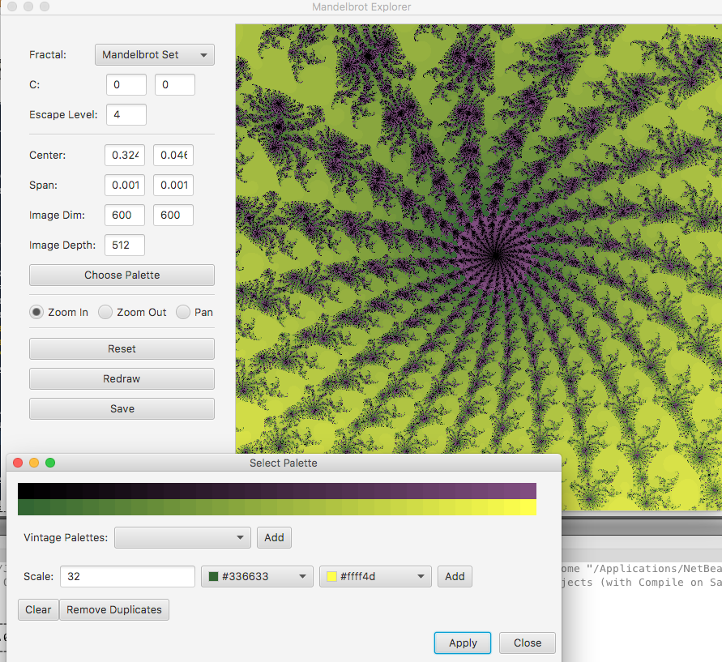

# JFX Fractal Explorer

This was a fun little project I wrote while learning the basics
of JavaFX.  It lets one play with the parameters of some basic
fractals and see their effects visually.

The radio buttons at the top select whether your clicks in the 
picture area will zoom in, zoom out, or simply pan the image.
You can also directly change the location and scale in the
text fields on the left.

The rendering happens across a 4-thread pool for speed.

